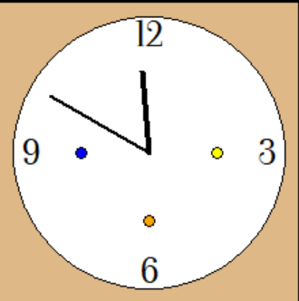

# 時計作成した。
- 一応役割だった時計の作成を行いました。時計機能とそれ以外の設計は以下の通りです。
## 現在実装されている機能 : 
- 時計機能
  - 1分ごとに現在時刻を取得して、5分単位で時刻変更。00:02 -> 描画は00:00, 00:03 -> 描画は00:05 といった感じ。5分刻みにしているのは長針の描画が荒くなるのが嫌だったから。変更してもよさそう。
- タスク管理機能
 - 12時間以内の予定が時計内に点としてプロットされている。(3,6,9時にカラー点があります。)
 - カーソルを点に合わせると予定が見られる(現在は登録した予定名と時間を表示してます。柔軟に変更可能。)
 - カラーについて、カテゴリに合わせて変更できればと考えています。(できれば白黒と見分けやすい暖色系で統一したい。)

上が現在の時計です。美的感覚が無いので、デザイン等付け加えてほしいです。大きさなどはひとまとめに操作できるようにしているので、大きさも自由に変更してください。
